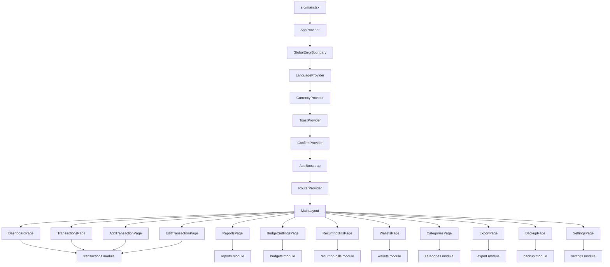
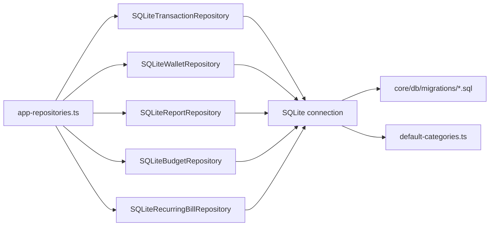
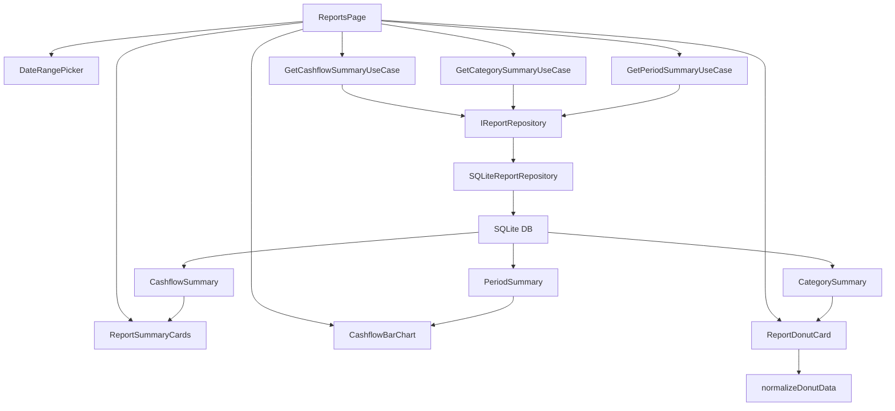
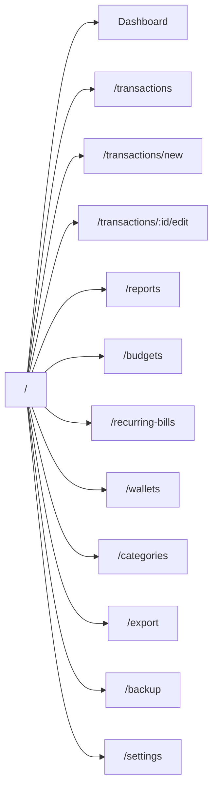

# Code Graph

## Application Architecture

```mermaid
flowchart TB
  main["src/main.tsx"] --> provider["AppProvider"]
  provider --> boundary["GlobalErrorBoundary"]
  boundary --> language["LanguageProvider"]
  language --> currency["CurrencyProvider"]
  currency --> toast["ToastProvider"]
  toast --> confirm["ConfirmProvider"]
  confirm --> bootstrap["AppBootstrap"]
  bootstrap --> router["RouterProvider"]
  router --> layout["MainLayout"]

  layout --> dashboard["DashboardPage"]
  layout --> transactions["TransactionsPage"]
  layout --> addTransaction["AddTransactionPage"]
  layout --> editTransaction["EditTransactionPage"]
  layout --> reports["ReportsPage"]
  layout --> budgets["BudgetSettingsPage"]
  layout --> recurring["RecurringBillsPage"]
  layout --> wallets["WalletsPage"]
  layout --> categories["CategoriesPage"]
  layout --> exportPage["ExportPage"]
  layout --> backup["BackupPage"]
  layout --> settings["SettingsPage"]

  dashboard --> transactionModule["transactions module"]
  transactions --> transactionModule
  addTransaction --> transactionModule
  editTransaction --> transactionModule
  reports --> reportsModule["reports module"]
  budgets --> budgetsModule["budgets module"]
  recurring --> recurringModule["recurring-bills module"]
  wallets --> walletsModule["wallets module"]
  categories --> categoriesModule["categories module"]
  exportPage --> exportModule["export module"]
  backup --> backupModule["backup module"]
  settings --> settingsModule["settings module"]
```

## Repository Layer

```mermaid
flowchart LR
  appRepos["app-repositories.ts"] --> txRepo["SQLiteTransactionRepository"]
  appRepos --> walletRepo["SQLiteWalletRepository"]
  appRepos --> reportRepo["SQLiteReportRepository"]
  appRepos --> budgetRepo["SQLiteBudgetRepository"]
  appRepos --> recurringRepo["SQLiteRecurringBillRepository"]

  txRepo --> sqlite["SQLite connection"]
  walletRepo --> sqlite
  reportRepo --> sqlite
  budgetRepo --> sqlite
  recurringRepo --> sqlite

  sqlite --> migrations["core/db/migrations/*.sql"]
  sqlite --> seed["default-categories.ts"]
```

## Reports Data Flow

```mermaid
flowchart TB
  reportsPage["ReportsPage"] --> filters["DateRangePicker"]
  reportsPage --> cashflowUC["GetCashflowSummaryUseCase"]
  reportsPage --> categoryUC["GetCategorySummaryUseCase"]
  reportsPage --> periodUC["GetPeriodSummaryUseCase"]

  cashflowUC --> reportRepo["IReportRepository"]
  categoryUC --> reportRepo
  periodUC --> reportRepo
  reportRepo --> sqliteReport["SQLiteReportRepository"]
  sqliteReport --> db["SQLite DB"]

  reportsPage --> summary["ReportSummaryCards"]
  reportsPage --> trend["CashflowBarChart"]
  reportsPage --> donut["ReportDonutCard"]
  donut --> normalize["normalizeDonutData"]

  db --> cashflow["CashflowSummary"]
  db --> category["CategorySummary"]
  db --> period["PeriodSummary"]
  cashflow --> summary
  period --> trend
  category --> donut
```

## Navigation Routes

```mermaid
flowchart LR
  root["/"] --> home["Dashboard"]
  root --> transactions["/transactions"]
  root --> newTx["/transactions/new"]
  root --> editTx["/transactions/:id/edit"]
  root --> reports["/reports"]
  root --> budgets["/budgets"]
  root --> recurring["/recurring-bills"]
  root --> wallets["/wallets"]
  root --> categories["/categories"]
  root --> export["/export"]
  root --> backup["/backup"]
  root --> settings["/settings"]
```
